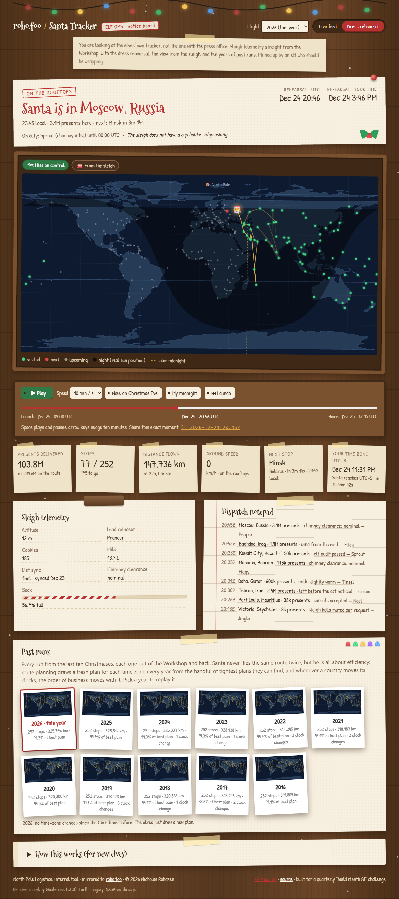
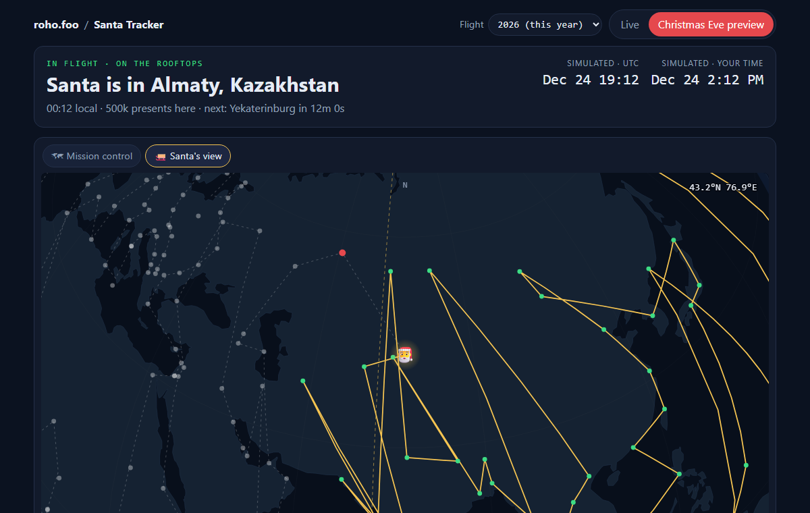

# Santa Tracker

*Santa rides the midnight line.*

A single-file Santa tracker: where the sleigh is right now, and, any day of
the year, where it will be on Christmas Eve. Live at **https://roho.foo/santa/**.





## What it does

- **Live mode.** Before December 24 the sleigh is parked at the North Pole with
  a countdown to launch. During the flight it shows Santa's position, the city
  he is in or heading to, and the counters. After the flight: mission complete.
- **Christmas Eve preview** (the challenge's required "as if it were December
  24–25" mode). The same code with a simulated clock: a scrubber across the
  whole 27-hour flight, play at 1 minute to 1 hour per second, *Now, on
  Christmas Eve* (today's time of day, dropped onto the big night), and *My
  midnight* (jump to when Santa reaches your time zone). Any instant can be
  deep-linked with `?t=2026-12-24T18:00Z`.
- **Two views.** *Mission control* is the whole world on an equirectangular
  map. *Santa's view* is an orthographic globe centred on the sleigh, north
  up: Santa stays in the middle, the world turns under him, a gold arrow is
  his heading to the next stop, and the night side, the solar-midnight line,
  the route and the stops are all drawn on the sphere. The choice sticks
  (`localStorage`) and `?view=pov` deep-links it.
- **Efficient routes.** Santa is all about efficiency. Inside each time zone
  the order is a travelling-salesman plan: nearest-neighbour tours from the
  cities closest to where the sleigh is coming from, polished with 2-opt
  until no two legs cross. The elves accept any plan within 6 % of the best
  one found, and the year's seed picks among those, so every year is a
  different route and every route is tight (about 320,000 km, each year
  within ~1 % of the best plan; the archive cards show the figure). Every
  route starts and ends at the Workshop.
- **A real map.** Natural Earth coastlines (110 m, embedded as TopoJSON and
  decoded in the page), the flown track in gold, upcoming stops dotted, and
  the **actual day/night terminator** computed from the sun's position for the
  instant on the clock. In December the entire Arctic sits in polar night, and
  Santa hugs the dashed solar-midnight line all the way around.
- **Telemetry.** Presents delivered, stops, distance, ground speed (Mach
  number included), next stop with ETA, when Santa reaches *your* time zone
  (computed from your browser's clock, using the December offset rather than
  today's), plus altitude, lead reindeer, cookie and milk intake, sack level,
  and a mission log with one deadpan note per city.
- **Every country.** 252 stops in 197 countries and territories: every country
  where someone is waiting up, one city each where only a capital was missing
  (Bethlehem stands in for Palestine, and yes, Vatican City gets a stop). Ten
  countries are left to sleep because public Christmas celebration there is
  banned or essentially absent; the list and the reason for each line are in
  `src/stops.mjs` (`SKIPPED`), where they can be argued with.
- **Flight archive.** The last ten Christmases, 2016 to 2026, as clickable
  mini-maps. Each year's plan is seeded by the year, so Santa never flies the
  same scribble twice and 2019 looks the same for everyone, forever. The stop
  list also carries real time-zone history (below), so when a country moved
  its clocks, its place in that year's route moved too. Past years render in
  the past tense with that year's real sun.
- **Self-contained and private.** One HTML file, no external requests after
  load, no analytics, no geolocation.

## How the route works

Santa delivers at local midnight, so he must sweep westward one time zone per
hour. The cities are grouped by their UTC offset on December 24 of the flight's
year (standard time in the north, summer time where the south observes it).
Zones run from UTC+14 (Kiritimati, 10:00 UTC Dec 24) to UTC−11 (Pago Pago and
Niue, 11:00 UTC Dec 25). Inside a zone the cities are spread evenly across that
zone's hour, so every city is reached within 30 minutes of its midnight; the
*order* inside the zone is the year's plan (`orderBand`): candidate tours are
nearest-neighbour from each of the four cities closest to where Santa is
coming from (the Workshop for the first zone) plus a few seeded starts, each
improved with 2-opt (`twoOpt`), and the seeded PRNG (`hash32(year,
zoneIndex)` → mulberry32) picks among the candidates within `PLAN_TOLERANCE`
(6 %) of the shortest. `route.efficiency` is best ÷ chosen over all zones.
Dwell per city is 30 % of the gap to the next one, capped at six minutes; in
between, the sleigh flies the great circle. Launch is one hour before the
first stop, home one hour after the last.

**Time-zone history** (`TZ_HISTORY` in `src/engine.mjs`): Samoa observed
summer time through 2020 (UTC+14 on Christmas Eve), Tonga tried it once in
2016, Fiji kept it through 2021, Brazil's summer time ended with 2018 (São
Paulo, Rio, Brasília on UTC−2 before that), Morocco was UTC+0 in winter
through 2017, Sudan was UTC+3 through 2016 and South Sudan through 2020,
Jordan and Syria changed their clocks through 2021 (UTC+2 in December),
Greenland was UTC−3 through 2022, and Kazakhstan's Almaty was UTC+6 through
2023. `routeChanges(year)` reports what moved versus the year before and the
page prints it under the archive.

The sun is the low-precision USNO algorithm (declination and subsolar point
from days since J2000, good to a hundredth of a degree). The terminator at
longitude λ is `atan(−cos(λ − λ_sun) / tan(δ))`; the dark polar cap is the
north one whenever δ < 0.

Everything is a pure function of `(year, time)`, which is what makes the
preview honest: it is not a demo reel, it is the live tracker with a different
clock. The year rolls over to the next Christmas once the sleigh is home.

## Layout

```
src/stops.mjs     252 cities (197 countries): lat, lon, UTC offset on Dec 24, metro population; SKIPPED list
src/engine.mjs    pure engine: route per year (seeded order + TZ history), position at time t, sun/terminator, telemetry, log, TopoJSON decoder
src/ui.js         DOM + SVG rendering, modes, year select + archive grid, scrubber, keyboard, ?t= / ?y= deep links
src/style.css     dark "ops dashboard" theme, phone-friendly
src/template.html page skeleton with /*__TOKENS__*/
data/land-110m.json  Natural Earth land, 110 m, from world-atlas@2 (public domain)
build.mjs         inlines everything into dist/index.html (~110 KB)
test/             node:test suite for the engine
```

```
npm test              # 25 engine tests
node build.mjs        # writes dist/index.html
```

Deploy = copy `dist/index.html` to `santa/index.html` in the roho.foo site
repo (GitHub Pages serves it as a static file).

## Origin

Built for my employer's quarterly "build an application from scratch with AI"
challenge (Q4 2026 theme: a Santa tracker; required feature: a mode that shows
Santa's location as if the date were December 24–25). Designed and written in
conversation with Claude (Claude Code), including the tests and this README.
The twist (ride the real midnight line, shade the real night) was chosen so
that the preview mode falls out of the physics instead of being a canned
animation.

Not affiliated with NORAD, Google, or the North Pole.

## License

MIT. Map data: Natural Earth (public domain) via
[world-atlas](https://github.com/topojson/world-atlas).
